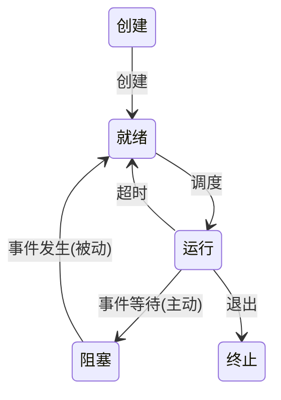

### 进程与线程

#### 进程的概念和特征

**进程实体** / 进程映像的构成：

- **进程控制块**(**PCB**)：每个进程专有的数据结构，描述进程的基本情况和运行状态，进而控制和管理进程。
- 程序段
- 数据段

#### 进程的组成

PCB 的内容：

- 进程描述信息：进程标识符(PID)，用户标识符(UID)。
- 进程控制和管理信息：进程当前状态，，进程优先级，代码运行入口地址，程序的外存地址，进入内存时间，CPU 占用时间，信号量使用。
- 资源分配清单：代码段指针，数据段指针，堆栈段指针，文件描述符，键盘，鼠标。
- 处理机相关信息：通用寄存器值，地址寄存器值，控制寄存器值，标志寄存器值，状态字。

#### 进程的状态与转换

进程的 5 种状态（前 3 种为基本状态）：

- **运行**：进程正在 CPU 上运行。
- **就绪**：进程获得了除 CPU 外的一切所需资源，一旦得到 CPU，便可立即运行。
- **阻塞**：进程正在等待某一事件而暂时无法运行，如等待 I/O 完成。
- **创建**
- **终止**

区别 *就绪* 和 *阻塞*：

- 就绪：仅缺少 CPU，一旦获得 CPU 就能运行。
- 阻塞：需要其他资源或等待某一事件。



#### 进程控制

父进程与子进程的关系：

- 进程创建另一个进程，创建者和被创建者为父子进程。
- 子进程继承父进程的资源。
- 撤销子进程时，将其资源归还父进程。
- 撤销父进程时，同时撤销所有子进程。

引发进程创建的事件：登录系统 / 作业调度 / 系统提供服务 / 用户程序请求。

> [!example] 进程创建
> 
> 1. 分配进程标识号。
> 2. 申请空白 PCB（失败时，创建失败）。
> 3. 分配资源（失败时，进程处于创建态）。
> 4. 初始化 PCB。
> 5. 插入就绪队列。
> 
> IBRIQ (Id -> Block -> Resource -> Init -> enQueue)

引发进程终止的事件：正常结束 / 异常结束 / 外界干预。

> [!example] 进程终止
> 
> 1. 读取 PCB。
> 2. 终止。
> 3. 终止子孙。
> 4. 归还资源（OS / 父进程）。
> 5. 删除 PCB。

引发进程阻塞的事件：请求系统资源失败 / 等待某种操作的完成 / 新数据尚未到达 / 无新任务可做。

> [!example] 进程阻塞
> 
> 1. 读取 PCB。
> 2. 保护现场。
> 3. 入等待队。

引发进程唤醒的事件：被阻塞进程期待的事件发生，如 I/O 完成或数据到达。

> [!example] 进程唤醒
> 
> 1. 读取 PCB。
> 2. 出等待队。
> 3. 入就绪队。

#### 进程的通信

高级通信方式：高效传输大量数据的通信方式。

- **共享存储**：通信的进程之间存在一块可直接访问的共享空间，通过对这片共享空间进行读写而通信。
- **消息传递**：利用 OS 提供的消息传递方法通信。
	- 直接通信方式：直接将消息发送到接收进程。
	- 间接通信方式：将消息发送到某个中间实体。
- **管道通信**：管道是一个特殊的共享文件，又称 pipe 文件，数据在管道中 FIFO，进程按生产者-消费者方式进行通信。
	- 管道只允许单向通信，若要双向，需要两个管道。

#### 线程和多线程模型

**线程**：

- 是轻量级进程。
- 是进程中的一个实体。
- 是被 OS 独立调度和分派的基本单位。
- （几乎）不拥有资源。
- 与同进程中的其他线程共享进程资源。
- 同进程中的多个线程可以并发。
- 也有就绪 / 运行 / 阻塞三种基本状态。
- 也有唯一的标识符和控制块（**线程控制块**，TCB）。

线程与进程：

- 线程切换的开销远小于进程（只需保存和设置少量寄存器内容，且在同一进程中切换线程不会引发进程切换）。
- 线程有更好的并发性，提高了系统资源的利用率和系统的吞吐量。
- 线程之间的同步和通信更易实现。

线程的实现：

- **用户级线程**(**ULT**)：用户可见，内核意识不到线程的存在，所有管理工作由应用程序在用户态完成，无须 OS 干预。
	- 👍 无模式切换 / 调度算法进程独立 / 实现与 OS 无关
	- 👎 系统调用时该进程内所有线程阻塞 / 无法利用多 CPU 的优势
- **内核级线程**(**KLT**)：在内核支持下运行，所有管理工作在内核态完成。
	- 👍 能利用多 CPU 的优势 / 不会“一阻全阻”
	- 👎 模式切换开销

多线程模型：

- **多对一**：将多个 ULT 映射到一个 KLT。
	- 👍 无模式切换
	- 👎 “一阻全阻”
- **一对一**：将每个 ULT 映射到一个 KLT。
	- 👍 高并发
	- 👎 开销大
- **多对多**：将 $n$ 个 ULT 映射到 $m$ 个 KLT（$n >= m$）。
	- 👍 均衡

### CPU 调度

#### 调度的概念

**CPU 调度**：分配 CPU 资源，从就绪队列中按某种算法选择一个进程并分配 CPU，实现进程并发。

三级调度：

- 高级调度 / 作业调度：为一个作业创建进程，为多道批处理系统特有。
- 中级调度 / 内存调度：将暂时无法运行的进程调入外存（挂起）。
- 低级调度 / 进程调度：按某种算法从就绪队列选择一个进程使其运行。

三级调度的特点：

- 作业调度次数少，中级调度次数略多，进程调度频率最高。
- 进程调度是最基本的，不可或缺。

#### 调度的实现

调度程序的构成：

- **排队器**
- **分派器**
- **上下文切换器**：对 CPU 进行切换时，会发生两次上下文切换——
	- 保存当前进程上下文，装入分派程序上下文。
	- 移出分派程序上下文，装入新选进程上下文。

需要进程调度与切换的情况：

- 创建新进程时。
- 进程正常结束 / 异常终止 / 阻塞时。
- I/O 完成后唤醒对应进程时。

不能进行进程的调度与切换的情况：

- 处理中断时。
- 执行原语时。

进程调度的方式：

- **非抢占式**：一个进程执行时，有优先级更高的进程就绪，仍继续执行原进程，直到其结束或阻塞。
- **抢占式**：上述条件发生时，允许调度程序根据某种原则暂停原进程，将 CPU 让给后者。

两种线程的调度：

- ULT：内核选择一个进程，由进程本身的调度程序决定线程调度。
- KLT：内核选择一个线程，不考虑其所属进程。

#### 调度的目标

评价调度算法的指标：

- **CPU 利用率**：$\large \frac{{\rm CPU}\space 有效工作时间}{{\rm CPU}\space 有效工作时间 + {\rm CPU}\space 空闲时间}$
- **系统吞吐量**：单位时间内 CPU 完成作业的数量。
- **周转时间**：从作业提交到完成的时间，是作业等待 / 排队 / 运行 / I/O 的时间之和，一般取平均值。
	- **带权周转时间**：$\large \frac{作业周转时间}{作业实际运行时间}$
- **等待时间**：进程排队的时间。
- **响应时间**：从用户提交请求到系统首次响应的时间。

#### 进程切换

*调度* 和 *切换*：

- 调度：决定资源分配，是决策。
- 切换：实际执行分配，是执行。

#### 典型的调度算法

| 调度算法       | 抢占  | 优点                        | 缺点                 | 适用    |
| ---------- | --- | ------------------------- | ------------------ | ----- |
| **先来先服务**  | 否   | 公平<br>简单                  | 不利于短作业             | 无     |
| **短作业优先**  | 可以  | 平均等待时间<br>和平均周转时间最短       | 长作业会饥饿<br>估计时间不易确定 | 批处理系统 |
| **高响应比优先** | 可以  | 兼顾长短作业                    | 计算响应比有开销           | 无     |
| **时间片轮转**  | 必须  | 兼顾长短作业                    | 平均等待时间长<br>上下文切换开销 | 分时系统  |
| **多级反馈队列** | 可以  | 队列自定义算法<br>响应时间较短<br>可行性强 | 实现复杂               | 通用    |

- 高响应比优先：$响应比 = {\Large \frac{等待时间 + 要求服务时间}{要求服务时间}}$
- **优先级**
	- 抢占式 / 非抢占式
	- 静态 / 动态
	- 一般优先级：系统进程 > 用户进程，交互型进程 > 非交互型进程，I/O 型进程 > 计算型进程。
- **多级队列**
	- 设置多个就绪队列，按进程的类型或性质分配，每个队列的调度算法独立，调度策略灵活。
	- 队列中的进程和队列本身都可以设置优先级。
	- 在多 CPU 系统中，可以为每个 CPU 设置一个单独的队列，实施各自不同的调度策略，从而利用多 CPU 的优势。
- 多级反馈队列
	- 多个就绪队列
	- 各队列进程分配的时间片不同
	- 每个队列采用 FCFS
	- 按队列优先级调度

### 同步与互斥

#### 同步与互斥的基本概念

**临界资源**：一次仅允许一个进程访问的资源，例如共享的数据和打印机等物理设备。

对临界资源的访问分为 4 部分（区）：

1. 进入 ~
2. 临界 ~
3. 退出 ~
4. 剩余 ~

```rust
loop {
    // entry
    // ! critical
    // exit
    // remainder
}
```

同步与互斥：

- **同步**：也称直接制约关系，为完成任务建立多个进程，它们由于需要协调运行次序而等待、传递信息所产生的制约关系。源于进程的 *合作*。
- **互斥**：也称间接制约关系，当一个进程访问临界资源时，另一个进程必须等待其退出临界区。源于进程的 *竞争*。

#### 实现临界区互斥的基本方法

- 软件实现方法
    - **单标志法** 👎 两个进程必须交替进入临界区，若其中一个不再进入，另一个也将无法进入。
    - **双标志先检查法** 👎 检查对方标志后、设置自己标志前可能发生进程切换，导致双方都检查通过，同时进入临界区。
    - **双标志后检查法** 👎 设置自己标志后、检查对方标志前可能发生进程切换，导致双方都检查失败，无一进入临界区。
    - **Peterson 算法**
        - 👍 遵循了“空闲让进”“忙则等待”“有限等待”
        - 👎 未遵循“让权等待”

```rust
/* Peterson 算法 */

// P0                            // P1
flag[0] = true;                  flag[1] = true;
turn = 1;                        turn = 0;
while flag[1] && turn == 1 {}    while flag[0] && turn == 0 {}
// ! critical                    // ! critical
flag[0] = false;                 flag[1] = false;
// remainder                     // remainder
```

- 硬件实现方法
	- **中断屏蔽方法**：当一个进程正在执行它的临界区代码时，防止其他进程进入其临界区的最简单方法是关中断。
	- **硬件指令方法——TestAndSet 指令**
	- **硬件指令方法——Swap 指令**

> [!error] P98

#### 互斥锁

进程进入临界区时调用 `acquire()` 上锁，退出临界区时调用 `release()` 解锁，`available` 表示锁的可用性。

```rust
/* 互斥锁 */

fn acquire() {
    while !available {}
    available = false;
}

fn release() {
    available = true;
}
```

`acquire()` 和 `release()` 必须为原子操作。

- 👎 忙等待
- 常用于多处理器系统，一个线程可以在一个处理器上旋转，而不影响其他线程。

#### 信号量

只能由原语 `wait()` 和 `signal()` 访问，简写为 `P()` 和 `V()`，简称 P 和 V 操作。

##### 整型信号量

用于表示资源数目的整型量 `S`。

```rust
fn wait(S) {
    while S <= 0 {}
    S -= 1;
}

fn signal(S) {
    S += 1;
}
```

##### 记录型信号量

除了整型信号量 `value`，还需一个进程链表 `L`，链接所有等待该资源的进程。

```rust
struct Semaphore {
    value: i32,
    L: std::collections::VecDeque<Process>,
}
```

对信号量 `S` 进行 P 操作，表示进程请求该类资源，先执行 `S.value -= 1`，若 `S.value < 0`，表示资源没有剩余，调用 `block` 原语自我阻塞，并插入 `S.L`。

```rust
fn wait(S: &Semaphore) {
    S.value -= 1;
    if S.value < 0 {
        S.L.push_back(P);
        block(S.L);
    }
}
```

对信号量 `S` 进行 V 操作，表示进程释放该类资源，先执行 `S.value += 1`，若 `S.value < 0`，表示有进程在等待，调用 `wakeup` 原语唤醒 `S.L` 中的一个进程。

```rust
fn signal(S: &Semaphore) {
    S.value += 1;
    if S.value <= 0 {
        P = S.L.pop_front();
        wakeup(P);
    }
}
```

##### 利用信号量实现同步

- 将信号量初值设为 `0`。
- 申请资源前执行 P 操作，提供资源后执行 V 操作。

```rust
let mut S = Semaphore::new(0);

fn P1(S: &mut Semaphore) {
    // 执行 x
    V(S); // 标记已执行 x
}

fn P2(S: &mut Semaphore) {
    P(S); // 等待 x
    // 使用 x 的结果执行 y
}
```

##### 利用信号量实现进程互斥

- 将信号量初值设为资源总量。
- 申请资源时执行 P 操作，释放资源时执行 V 操作。
- P 和 V 操作夹紧临界区（中间不能有其他代码）。

```rust
let mut S = Semaphore::new(1);

fn P1(S: &mut Semaphore) {
    P(S); // 加锁
    // ! critical
    V(S); // 解锁
}

fn P2(S: &mut Semaphore) {
    P(S); // 加锁
    // ! critical
    V(S); // 解锁
}
```

#### 经典同步问题

##### 生产者-消费者问题

- 一组生产者和一组消费者共享一个大小为 `n`、初始为空的缓冲区。
- 缓冲区有空余时，生产者才能放入消息，否则阻塞。
- 缓冲区有内容时，消费者才能取出消息，否则阻塞。

```rust
let mut mutex = Semaphore::new(1); // 互斥
let mut empty = Semaphore::new(n); // 空余数量
let mut full = Semaphore::new(0);  // 内容数量

fn producer() {
    loop {
        // 生产
        P(empty);
        
        P(mutex);
        // ! 放入
        V(mutex);
        
        V(full);
    }
}

fn consumer() {
    loop {
        P(full);
        
        P(mutex);
        // ! 取出
        V(mutex);
        
        V(empty);
        // 消费
    }
}
```

- 有一个盘子，最多能放一个水果。
- 爸爸只放苹果，妈妈只放橘子；儿子只取橘子，女儿只取苹果。
- 只有盘子为空时，爸爸或妈妈才可放入；只有盘子不空时，儿子或女儿才可取出。

```rust
let mut plate = Semaphore::new(1);
let mut apple = Semaphore::new(0);
let mut orange = Semaphore::new(0);

fn dad() {
    loop {
        // 生产(苹果)
        P(plate);
        // ! 放入(苹果)
        V(apple);
    }
}

fn mom() {
    loop {
        // 生产(橘子)
        P(plate);
        // ! 放入(橘子)
        V(orange);
    }
}

fn son() {
    loop {
        P(orange);
        // ! 取出(橘子)
        V(plate);
        // 消费(橘子)
    }
}

fn daughter() {
    loop {
        P(apple);
        // ! 取出(苹果)
        V(plate);
        // 消费(苹果)
    }
}
```

##### 读者-写者问题

- 同一时间，允许多个读者读取，或者一个写者写入。
- 写者写入前，等待已有的读者或写者完成。
- 写者写入时，其它读者或写者等待其完成。

```rust
let mut count = 0;
let mut mutex = Semaphore::new(1);
let mut rw = Semaphore::new(1);

fn writer() {
    loop {
        P(rw);
        // ! 写入
        V(rw);
    }
}

fn reader() {
    loop {
        P(mutex);
        
        if count == 0 {
            P(rw);
        }
        count += 1;
        
        V(mutex);
        // ! 读取
        P(mutex);
        
        count -= 1;
        if count == 0 {
            V(rw);
        }
        
        V(mutex);
    }
}
```

##### 哲学家进餐问题

仅当一名哲学家左右两边的筷子都可用时，才允许他抓起筷子。

```rust
let mut chopstick = [1, 1, 1, 1, 1].map(|x| Semaphore::new(x))
                                   .collect();
let mut mutex = Semaphore::new(1);

fn Pi() {
    loop {
        P(mutex);
        P(chopstick[i]);
        P(chopstick[(i + 1) % 5]);
        
        V(mutex);
        // ! 进餐
        V(chopstick[i]);
        V(chopstick[(i + 1) % 5]);
    }
}
```

#### 管程

**管程**：一种抽象数据结构，它封装了共享资源和对资源操作的过程，通过互斥访问和进程同步来确保资源的安全使用。

> [!info] 类比 *管程* 为 *银行柜台*
> 
> - 柜台是共享资源，客户（进程）想要操作它。
> - 柜台有明确的规则：一次只能服务一个客户（互斥访问）。
> - 如果客户太多，有的客户需要排队等待资源可用（阻塞与唤醒）。
> - 柜台操作的所有细节都由银行员工（管程的操作）来处理，客户不直接接触后台系统（共享数据结构）。

管程的构成：

- 管程的名称。
- 管程内部的共享数据结构说明。
- 操作数据结构的一组过程（函数）。
- 初始化管程内部共享数据的语句。

### 死锁

#### 死锁的概念

**死锁**：一组进程互相等待其它进程释放资源，而都无法继续执行的情况。

**饥饿**：一个进程可以执行而长时间不得以执行（通常源于不公平的分配策略）。

死锁和饥饿：

- 存在饥饿 $arrow.r.double.not$ 存在死锁。
- 饥饿的进程可以只有一个，死锁的进程必至少为两个。
- 饥饿的进程可能处于就绪态（长期得不到 CPU）或阻塞态（长期得不到 I/O 设备），死锁的进程必处于阻塞态。

> [!example] 死锁的必要条件
> 
> - **互斥**：进程独占资源。
> - **不可剥夺**：资源只能由进程主动释放。
> - **请求并保持条件**：进程获得部分资源并请求更多资源时，保持已获得的部分，即使处于阻塞态。
> - **循环等待条件**：存在一条进程的循环等待链，链中每个进程保持的资源同时被下一个进程请求。

死锁的处理策略：

| 策略          | 程度  | 模式                         | 👍     | 👎            |
| ----------- | --- | -------------------------- | ------ | ------------- |
| ~ **预防**    | 严格  | 一次请求所有资源<br>资源剥夺<br>资源按序分配 | 不剥夺    | 延长初始化<br>灵活性差 |
| ~ **避免**    | 均衡  | 寻找安全序列                     | 不剥夺    | 需要预知需求        |
| ~ **检测和恢复** | 宽松  | 检查死锁的存在                    | 不延长初始化 | 剥夺            |

#### 死锁预防

> [!example] 死锁预防（破坏任一必要条件）
> 
> - 互斥：允许共享资源。（👎 不切实际）
> - 不可剥夺：当一个进程请求更多资源失败时，必须释放已保持的资源。（可用于状态易于保存和恢复的资源，如 CPU 的寄存器及内存资源）
> - 请求并保持
>     - 预先静态分配（👎 可能资源浪费 / 饥饿）
>     - 运行时动态分配（👍 改进）
> - 循环等待：顺序资源分配法，给资源编号，规定进程必须按编号递增的顺序请求资源，且同类资源一次性申请。（👎 资源浪费 / 不便于增加新类型设备）

#### 死锁避免

##### 系统安全状态

在每次分配资源的过程中，都要分析此次分配是否会带来死锁风险，只在无风险情况下系统才执行分配。（👍 限制条件较弱，可以获得较好的系统性能）

**安全状态**：系统能按某种运行顺序 $P_1, dots.c, P_n$ 为每个进程 $P_i$ 分配其所需的资源，直至满足每个进程对资源的最大需求（使每个进程都可完成运行），此时称该顺序为安全序列。若系统无法找到一个安全序列，则称系统处于 **不安全状态**。

系统处于 `match`

- 安全状态 => 不可能死锁
- 不安全状态 => 有可能死锁

##### 银行家算法

> [!example] 银行家算法
> 
> 1. 进程声明对各类资源的需求量。
> 2. 进程申请资源时，系统检查是否有足够的可分配资源，若没有则拒绝。
> 3. 系统再检查执行分配后是否会进入不安全状态，若是则拒绝。
> 4. 系统执行资源分配。

#### 死锁检测和解除

##### 死锁检测

**资源分配图**：

- 圆圈表示进程，框表示一类资源，框中的一个圆表示该类资源中的一个。
- 请求边：进程 -> 资源的有向边，表示该进程申请一个该类资源。
- 分配边：资源 -> 进程的有向边，表示该进程持有一个该类资源。

![[OS-resource_assignment_graph.png|400]]

> [!example] 资源分配图简化规则
> 
> 1. 找到一个系统的剩余资源能满足其要求的进程 $P_i$（其所有出边指向的资源 $R_j$ 的余量都能满足其要求），如果找不到这样的进程，算法结束。
> 2. 消除 $P_i$ 的所有入边和出边，从而释放一部分资源。
> 3. 转 `1.`。

**可完全简化**：能够根据简化规则消除图中的所有边时，称图可完全简化。

**死锁定理**：系统状态 $S$ 为死锁 <=> $S$ 的资源分配图不可完全简化。

##### 死锁解除

- **资源剥夺法**：挂起某些死锁进程，剥夺其资源并分配给其他死锁进程。
- **撤销进程法**：终止某些（甚至全部）死锁进程，剥夺其资源。
- **进程回退法**：回退一部分死锁进程到足以回避死锁的地步，自愿释放资源。
