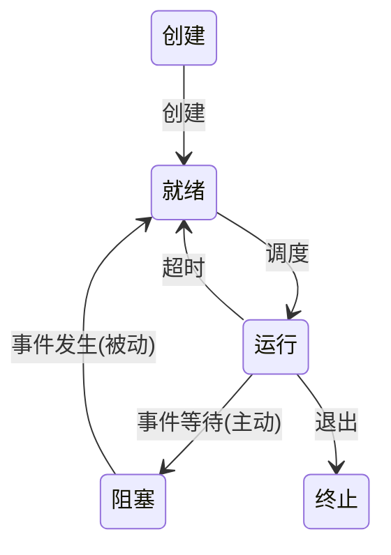

## 01 计算机系统概述

### 操作系统的基本概念

#### 操作系统的特征

- **并发**：多个事件在同一时段发生。
	- *并发* 在同一时刻执行一个操作，*并行* 在同一时刻执行多个操作。
- **共享**：系统中的资源可供多个并发执行的进程共用。
	- *互斥共享*：如打印机。
	- *同时访问共享*：如磁盘。
- **虚拟**：将一个物理实体抽象为若干逻辑对应。
- **异步**：多个程序并发执行，执行顺序具有不可预知性。

#### 操作系统的目标和功能

操作系统提供的接口：**命令接口**（联机命令接口 / 脱机命令接口）/ **程序接口**。

### 操作系统发展历程

![[OS-evolution.png|600]]

### 操作系统的运行环境

#### 处理器运行模式

特权指令和非特权指令：

- **特权指令**：不允许用户直接使用的指令，有 I/O 指令 / 关中断指令 / 内存清零指令 / 存取用于内存保护的寄存器的指令 / 送 `PSW` 到程序状态字寄存器的指令等。
- **非特权指令**：允许用户直接使用的指令，仅限访问用户的地址空间，不能直接访问系统软硬件资源，防止用户程序破坏系统。

CPU 的运行模式：

- **内核态**：可以执行特权指令（=> 切换用户态的指令是特权的）。
- **用户态**：只能执行非特权指令（=> 切换内核态的指令是非特权的）。

引发切换内核态的事件：

- 系统调用
- 发生中断
- 用户程序出错
- 用户程序试图执行特权指令

#### 中断和异常的概念

发生中断或异常时，处于用户态的 CPU 立即切换内核态（硬件实现）。

#### 系统调用

系统调用的功能：设备管理 / 文件管理 / 进程控制 / 进程通信 / 内存管理。

> [!example] 系统调用的处理
> 
> 1. 将系统调用号和所需的参数压栈，调用实际的调用指令，执行陷入指令，CPU 切换内核态，保护被中断进程的现场。
> 2. 分析系统调用类型，执行相应的系统调用处理子程序。
> 3. 恢复被中断的进程的现场，返回继续执行。

### 操作系统结构

- **分层法**：将 OS 分为若干层，每层只能调用紧邻它的低层的功能和服务。
	- 👍 便于调试 / 可扩展 / 可维护
	- 👎 灵活性差 / 低效
- **模块化**：将 OS 按功能划分为若干具有一定独立性的模块，每个模块具有某方面的管理功能，各模块通过接口通信。
	- 👍 可维护 / 可适应
	- 👎 接口混乱
- **宏内核**：将 OS 的主要功能模块作为一个紧密联系的整体运行在核心态，为用户程序提供高性能的系统服务。
	- 👍 高效
	- 👎 庞杂
- **微内核**：将内核中最基本的功能保留在内核，将不需要在核心态执行的功能移到用户态执行，降低内核的设计复杂性。移出内核的操作系统代码根据分层的原则被划分成若干服务程序，相互独立，借助微内核通信。
	- 👍 可扩展 / 可靠 / 可移植
	- 👎 性能差于宏内核

### 操作系统引导

> [!example] OS 的引导
> 
> 1. 激活 CPU，执行 BIOS。
> 2. BIOS 构建中断向量表，通电自检。
> 3. 加载带有 OS 的硬盘。
> 4. 加载主引导记录(MBR)。
> 5. 加载硬盘活动分区。
> 6. 加载分区引导记录(PBR)。
> 7. 加载启动管理器。
> 8. 加载 OS。

### 虚拟机

- **第一类虚拟机管理程序**：直接运行在裸机上，相当于操作系统。
- **第二类虚拟机管理程序**：运行在宿主操作系统上，相当于一个用户程序。

![[OS-virtual_machine.png|600]]

## 02 进程与线程

### 进程与线程

#### 进程的概念和特征

**进程实体** / 进程映像的构成：

- **进程控制块**(**PCB**)：每个进程专有的数据结构，描述进程的基本情况和运行状态，进而控制和管理进程。
- 程序段
- 数据段

#### 进程的组成

PCB 的内容：

- 进程描述信息：进程标识符(PID)，用户标识符(UID)。
- 进程控制和管理信息：进程当前状态，，进程优先级，代码运行入口地址，程序的外存地址，进入内存时间，CPU 占用时间，信号量使用。
- 资源分配清单：代码段指针，数据段指针，堆栈段指针，文件描述符，键盘，鼠标。
- 处理机相关信息：通用寄存器值，地址寄存器值，控制寄存器值，标志寄存器值，状态字。

#### 进程的状态与转换

进程的 5 种状态（前 3 种为基本状态）：

- **运行**：进程正在 CPU 上运行。
- **就绪**：进程获得了除 CPU 外的一切所需资源，一旦得到 CPU，便可立即运行。
- **阻塞**：进程正在等待某一事件而暂时无法运行，如等待 I/O 完成。
- **创建**
- **终止**

区别 *就绪* 和 *阻塞*：

- 就绪：仅缺少 CPU，一旦获得 CPU 就能运行。
- 阻塞：需要其他资源或等待某一事件。



#### 进程控制

父进程与子进程的关系：

- 进程创建另一个进程，创建者和被创建者为父子进程。
- 子进程继承父进程的资源。
- 撤销子进程时，将其资源归还父进程。
- 撤销父进程时，同时撤销所有子进程。

引发进程创建的事件：登录系统 / 作业调度 / 系统提供服务 / 用户程序请求。

> [!example] 进程创建
> 
> 1. 分配进程标识号。
> 2. 申请空白 PCB（失败时，创建失败）。
> 3. 分配资源（失败时，进程处于创建态）。
> 4. 初始化 PCB。
> 5. 插入就绪队列。
> 
> IBRIQ (Id -> Block -> Resource -> Init -> enQueue)

引发进程终止的事件：正常结束 / 异常结束 / 外界干预。

> [!example] 进程终止
> 
> 1. 读取 PCB。
> 2. 终止。
> 3. 终止子孙。
> 4. 归还资源（OS / 父进程）。
> 5. 删除 PCB。

引发进程阻塞的事件：请求系统资源失败 / 等待某种操作的完成 / 新数据尚未到达 / 无新任务可做。

> [!example] 进程阻塞
> 
> 1. 读取 PCB。
> 2. 保护现场。
> 3. 入等待队。

引发进程唤醒的事件：被阻塞进程期待的事件发生，如 I/O 完成或数据到达。

> [!example] 进程唤醒
> 
> 1. 读取 PCB。
> 2. 出等待队。
> 3. 入就绪队。

#### 进程的通信

高级通信方式：高效传输大量数据的通信方式。

- **共享存储**：通信的进程之间存在一块可直接访问的共享空间，通过对这片共享空间进行读写而通信。
- **消息传递**：利用 OS 提供的消息传递方法通信。
	- 直接通信方式：直接将消息发送到接收进程。
	- 间接通信方式：将消息发送到某个中间实体。
- **管道通信**：管道是一个特殊的共享文件，又称 pipe 文件，数据在管道中 FIFO，进程按生产者-消费者方式进行通信。
	- 管道只允许单向通信，若要双向，需要两个管道。

#### 线程和多线程模型

**线程**：

- 是轻量级进程。
- 是进程中的一个实体。
- 是被 OS 独立调度和分派的基本单位。
- （几乎）不拥有资源。
- 与同进程中的其他线程共享进程资源。
- 同进程中的多个线程可以并发。
- 也有就绪 / 运行 / 阻塞三种基本状态。
- 也有唯一的标识符和控制块（**线程控制块**，TCB）。

线程与进程：

- 线程切换的开销远小于进程（只需保存和设置少量寄存器内容，且在同一进程中切换线程不会引发进程切换）。
- 线程有更好的并发性，提高了系统资源的利用率和系统的吞吐量。
- 线程之间的同步和通信更易实现。

线程的实现：

- **用户级线程**(**ULT**)：用户可见，内核意识不到线程的存在，所有管理工作由应用程序在用户态完成，无须 OS 干预。
	- 👍 无模式切换 / 调度算法进程独立 / 实现与 OS 无关
	- 👎 系统调用时该进程内所有线程阻塞 / 无法利用多 CPU 的优势
- **内核级线程**(**KLT**)：在内核支持下运行，所有管理工作在内核态完成。
	- 👍 能利用多 CPU 的优势 / 不会“一阻全阻”
	- 👎 模式切换开销

多线程模型：

- **多对一**：将多个 ULT 映射到一个 KLT。
	- 👍 无模式切换
	- 👎 “一阻全阻”
- **一对一**：将每个 ULT 映射到一个 KLT。
	- 👍 高并发
	- 👎 开销大
- **多对多**：将 $n$ 个 ULT 映射到 $m$ 个 KLT（$n >= m$）。
	- 👍 均衡

### CPU 调度

#### 调度的概念

**CPU 调度**：分配 CPU 资源，从就绪队列中按某种算法选择一个进程并分配 CPU，实现进程并发。

三级调度：

- 高级调度 / 作业调度：为一个作业创建进程，为多道批处理系统特有。
- 中级调度 / 内存调度：将暂时无法运行的进程调入外存（挂起）。
- 低级调度 / 进程调度：按某种算法从就绪队列选择一个进程使其运行。

三级调度的特点：

- 作业调度次数少，中级调度次数略多，进程调度频率最高。
- 进程调度是最基本的，不可或缺。

#### 调度的实现

调度程序的构成：

- **排队器**
- **分派器**
- **上下文切换器**：对 CPU 进行切换时，会发生两次上下文切换——
	- 保存当前进程上下文，装入分派程序上下文。
	- 移出分派程序上下文，装入新选进程上下文。

需要进程调度与切换的情况：

- 创建新进程时。
- 进程正常结束 / 异常终止 / 阻塞时。
- I/O 完成后唤醒对应进程时。

不能进行进程的调度与切换的情况：

- 处理中断时。
- 执行原语时。

进程调度的方式：

- **非抢占式**：一个进程执行时，有优先级更高的进程就绪，仍继续执行原进程，直到其结束或阻塞。
- **抢占式**：上述条件发生时，允许调度程序根据某种原则暂停原进程，将 CPU 让给后者。

两种线程的调度：

- ULT：内核选择一个进程，由进程本身的调度程序决定线程调度。
- KLT：内核选择一个线程，不考虑其所属进程。

#### 调度的目标

评价调度算法的指标：

- **CPU 利用率**：$\large \frac{{\rm CPU}\space 有效工作时间}{{\rm CPU}\space 有效工作时间 + {\rm CPU}\space 空闲时间}$
- **系统吞吐量**：单位时间内 CPU 完成作业的数量。
- **周转时间**：从作业提交到完成的时间，是作业等待 / 排队 / 运行 / I/O 的时间之和，一般取平均值。
	- **带权周转时间**：$\large \frac{作业周转时间}{作业实际运行时间}$
- **等待时间**：进程排队的时间。
- **响应时间**：从用户提交请求到系统首次响应的时间。

#### 进程切换

*调度* 和 *切换*：

- 调度：决定资源分配，是决策。
- 切换：实际执行分配，是执行。

#### 典型的调度算法

| 调度算法   | 抢占  | 👍                        | 👎                 | 适用    |
| ------ | --- | ------------------------- | ------------------ | ----- |
| 先来先服务  | 否   | 公平<br>简单                  | 不利于短作业             | 无     |
| 短作业优先  | 可以  | 平均等待时间<br>和平均周转时间最短       | 长作业会饥饿<br>估计时间不易确定 | 批处理系统 |
| 高响应比优先 | 可以  | 兼顾长短作业                    | 计算响应比有开销           | 无     |
| 时间片轮转  | 可以  | 兼顾长短作业                    | 平均等待时间长<br>上下文切换开销 | 分时系统  |
| 多级反馈队列 | 可以  | 队列自定义算法<br>响应时间较短<br>可行性强 | 实现复杂               | 通用    |

- **高响应比优先**：$响应比 = {\Large \frac{等待时间 + 要求服务时间}{要求服务时间}}$
- **优先级**
	- 抢占式 / 非抢占式
	- 静态 / 动态
	- 一般优先级：系统进程 > 用户进程，交互型进程 > 非交互型进程，I/O 型进程 > 计算型进程。
- **多级队列**
	- 在系统中设置多个就绪队列，将不同类型或性质的进程固定分配到不同的就绪队列。每个队列可实施不同的调度算法，因此系统针对不同用户进程的需求，很容易提供多种调度策略。
	- 同一队列中的进程可以设置不同的优先级，不同的队列本身也可以设置不同的优先级。
	- 在多 CPU 系统中，可以很方便为每个 CPU 设置一个单独的就绪队列，每个 CPU 可实施各自不同的调度策略，这样就能根据用户需求将多个线程分配到一个或多个 CPU 上运行。
- **多级反馈队列**
	- 多个就绪队列
	- 各队列进程分配的时间片不同
	- 每个队列采用 FCFS
	- 按队列优先级调度

### 同步与互斥

#### 同步与互斥的基本概念

临界资源：一次仅允许一个进程使用的资源。许多物理设备如打印机属于临界资源，许多变量、数据等都可以被若干进程共享，也属于临界资源。

对临界资源的访问分为 4 部分（区）：

1. 进入 ~
2. 临界 ~
3. 退出 ~
4. 剩余 ~

```c
while(true) {
    // entry
    // critical
    // exit
    // remainder
}
```

同步与互斥：

- 同步：也称直接制约关系，为完成某种任务而建立的两个或多个进程，这些进程因为需要协调它们的运行次序而等待、传递信息所产生的制约关系。源于进程的相互合作。
- 互斥：也称间接制约关系，当一个进程进入临界区使用临界资源时，另一个进程必须等待，当占用临界资源的进程退出临界区后，另一进程才允许去访问此临界资源。源于进程的相互竞争。

#### 实现临界区互斥的基本方法

- 软件实现方法
	- **单标志法** 👎 两个进程必须交替进入临界区，若某个进程不再进入临界区，则另一个进程也将无法进入临界区。
	- **双标志先检查法** 👎 检查对方标志后和设置自己的标志前可能发生进程切换，结果双方都检查通过，会同时进入临界区。
	- **双标志后检查法** 👎 两个进程依次设置自己的标志，并依次检查对方的标志，发现对方也想进入临界区，双方都争着进入临界区，结果谁也进不了。
	- **Peterson 算法** 👍 遵循了“空闲让进”“忙则等待”“有限等待” 👎 未遵循“让权等待”。

```c
/* Peterson 算法 */
// P0                        // P1
flag[0] = true;              flag[1] = true;
turn = 1;                    turn = 0;
while(flag[1] && turn==1);   while(flag[0] && turn==0);
// critical                  // critical
flag[0] = false;             flag[1] = false;
// remainder                 // remainder
```

- 硬件实现方法
	- **中断屏蔽方法**：当一个进程正在执行它的临界区代码时，防止其他进程进入其临界区的最简单方法是关中断。因为 CPU 只在发生中断时引起进程切换。
	- **硬件指令方法——TestAndSet 指令**
	- **硬件指令方法——Swap 指令**

> [!error] P98

#### 互斥锁

一个进程在进入临界区时调用 `acquire()` 以获得锁，在退出临界区时调用 `release()`以释放锁。每个互斥锁有一个布尔变量 `available`，表示锁是否可用。如果锁是可用的，调用 `acquire()` 会成功，且锁不再可用。当一个进程试图获取不可用的锁时，会被阻塞，直到锁被释放。

```c
/* 互斥锁 */
acquire() {
    while(!available);
    available = false;
}

release() {
    available = true;
}
```

`acquire()` 和 `release()` 必须为原子操作。

- 👎 忙等待
- 通常用于多处理器系统，一个线程可以在一个处理器上旋转，而不影响其他线程的执行。

#### 信号量

只能被两个标准的原语 `wait()` 和 `signal()` 访问，也可简写为 `P()` 和 `V()`，或者简称 P 操作和 V 操作。

##### 整型信号量

用于表示资源数目的整型量 `S`，操作只有初始化、`wait()` 和 `signal()`。

```c
wait(S) {
    while (S <= 0);
    S--;
}

signal (S) {
    S++;
}
```

##### 记录型信号量

除了需要一个用于代表资源数目的整型变量 `value` 外，再增加一个进程链表 `L`，用于链接所有等待该资源的进程。

```c
typedef struct {
    int value;
    struct process *L;
} semaphore;
```

```c
void wait(semaphore S) {
    S.value--;
    if(S.value < 0) {
        // add process to S.L
        block(S.L);
    }
}
```

对信号量 S 的一次 P 操作，表示进程请求一个该类资源，因此执行 S.value--，使系统中可供分配的该类资源数减 1。当 S.value<0 时，表示该类资源已分配完毕，因此应调用 block 原语进行自我阻塞（当前运行的进程：运行态 -> 阻塞态），主动放弃 CPU，并插入该类资源的等待队列 S.L，可见该机制遵循了“让权等待”准则。

```c
void signal(semaphore S) {
    S.value++;
    if(S.value <= 0) {
        // pop a process from S.L
        wakeup(P);
    }
}
```

对信号量 S 的一次 V 操作，表示进程释放一个该类资源，因此执行 S.value++，使系统中可供分配的该类资源数加 1。若加 1 后仍是 S.value<0，则表示仍有进程在等待该类资源，因此应调用 wakeup 原语将 S.L 中的第一个进程唤醒（被唤醒进程：阻塞态 -> 就绪态）。

##### 利用信号量实现同步

若某个行为会提供资源 `res`，则在这个行为之后 `V(res)`；若某个行为要用到 `res`，则在这个行为之前 `P(res)`。

```c
semaphore S = 0;

P1() {
    x;    // 执行 x
    V(S); // 告诉 P2 已执行 x
    // ...
}

P2() {
    // ...
    P(S); // 检查 x 是否已执行
    y;    // 获得 x 的结果, 执行 y
    // ...
}
```

##### 利用信号量实现进程互斥

- 有多少资源就将信号量初值设为多少，申请资源时执行 P 操作，释放资源时执行 V 操作。
- P 和 V 操作要紧夹使用临界资源的行为，中间不能有其他余代码。

```c
semaphore S = 1;

P1() {
    // ...
    P(S); // 加锁
    // ! critical
    V(S); // 解锁
    // ...
}

P2() {
    // ...
    P(S); // 加锁
    // ! critical
    V(S); // 解锁
    // ...
}
```

#### 经典同步问题

##### 生产者-消费者问题

一组生产者进程和一组消费者进程共享一个初始为空、大小为 n 的缓冲区。只有当缓冲区不满时，生产者才能将消息放入缓冲区；否则必须阻塞，等待消费者从缓冲区中取出消息后将其唤醒。只有当缓冲区不空时，消费者才能从缓冲区中取出消息；否则必须等待，等待生产者将消息放入缓冲区后将其唤醒。由于缓冲区是临界资源，因此必须互斥访问。

```c
semaphore mutex = 1;
semaphore empty = n;
semaphore full = 0;

producer() {
    while(1) {
        // produce an item
        P(empty);
        P(mutex);
        // ! put item into buffer
        V(mutex);
        V(full);
    }
}

consumer() {
    while(1) {
        P(full);
        P(mutex);
        // ! get item from buffer
        V(mutex);
        V(empty);
        // consume the item
    }
}
```

桌子上有一个盘子，每次只能向其中放入一个水果。爸爸专向盘子中放苹果，妈妈专向盘子户放橘子，儿子专等吃盘子中的橘子，女儿专等吃盘子中的苹果。只有盘子为空时，爸爸或妈妈才可向盘子中放一个水果；仅当盘子中有自己需要的水果时，儿子或女儿可以从盘子中取出。

```c
semaphore plate = 1;
semaphore apple = 0;
semaphore orange = 0;

dad() {
    while(1) {
        // produce an apple
        P(plate);
        // ! put apple onto plate
        V(apple);
    }
}

mom() {
    while(1) {
        // produce an orange
        P(plate);
        // ! put orange onto plate
        V(orange);
    }
}

son() {
    while(1) {
        P(orange);
        // ! take orange from plate
        V(plate);
        // consume the orange
    }
}

daughter() {
    while(1) {
        P(apple);
        // ! take apple from plate
        V(plate);
        // consume the apple
    }
}
```

##### 读者-写者问题

要求：

- 允许多个读者可以同时对文件执行读操作。
- 只允许一个写者往文件中写信息。
- 任意一个写者在完成写操作之前不允许其他读者或写者工作。
- 写者执行写操作前，应让已有的读者和写者全部退出。

```c
int count = 0;
semaphore mutex = 1;
semaphore rw = 1;

writer() {
    while(1) {
        P(rw);
        // ! write
        V(rw);
    }
}

reader() {
    while(1) {
        P(mutex);
        if (count == 0) {
            P(rw);
        }
        count++;
        
        V(mutex);
        // ! read
        P(mutex);
        
        count--;
        if (count == 0) {
            V(rw);
        }
        V(mutex);
    }
}
```

> [!error] 写者优先 P107

##### 哲学家进餐问题

仅当一名哲学家左右两边的筷子都可用时，才允许他抓起筷子。

```c
semaphore chopstick[5] = {1, 1, 1, 1, 1};
semaphore mutex = 1;

Pi() {
    do {
        P(mutex);
        P(chopstick[i]);
        P(chopstick[(i + 1) % 5]);
        V(mutex);
        // ! eat
        V(chopstick[i]);
        V(chopstick[(i + 1) % 5]);
    } while(1);
}
```

#### 管程

利用共享数据结构抽象地表示系统中的共享资源，而将对该数据结构实施的操作定义为一组过程。进程对共享资源的申请、释放等操作，都通过这组过程来实现，这组过程还可以根据资源情况，或接受或阻塞进程的访问，确保每次仅有一个进程使用共享资源，这样就可以统一管理对共享资源的所有访问，实现进程互斥。这个代表共享资源的数据结构，以及由对该共享数据结构实施操作的一组过程所组成的资源管理程序，称为管程(monitor)。管程定义了一个数据结构和能为并发进程所执行(在该数据结构上)的一组操作，这组操作能同步进程和改变管程中的数据。

管程由 4 部分组成：

- 管程的名称。
- 局部于管程内部的共享数据结构说明。
- 对该数据结构进行操作的一组过程(或函数)。
- 对局部于管程内部的共享数据设置初始值的语句。

> [!error] 条件变量 P110

### 死锁

#### 死锁的概念

死锁：多个进程因竞争资源而造成的一种僵局（互相等待对方手里的资源），使得各个进程都被阻塞，若无外力干涉，这些进程都无法向前推进。

产生饥饿的主要原因是:当系统中有多个进程同时申请某类资源时，由分配策略确定资源分配给进程的次序，有的分配策略可能是不公平的，即不能保证等待时间上界的存在。在这种情况下，即使系统未发生死锁，某些进程也可能长时间等待。当等待时间给进程的推进带来明显影响时，称发生了饥饿。

饥饿并不表示系统一定死锁，但至少有一个进程的执行被无限期推迟。

死锁和饥饿的主要差别

- 发生饥饿的进程可以只有一个;而死锁是因循环等待对方手里的资源而导致的，因此，如果有死锁现象，那么发生死锁的进程必然大于或等于两个。
- 发生饥饿的进程可能处于就绪态(长期得不到 CPU，如 SIF 算法的问题)，也可能处于阻塞态(如长期得不到所需的 IO 设备，如上述举例);而发生死锁的进程必定处于阻塞态。

死锁产生的必要条件：

- 互斥：进程要求对所分配的资源进行排他性使用。
- 不可剥夺：进程所获得的资源在未使用完之前，不能被其他进程强行夺走，即只能由获得该资源的进程自己来释放(只能是主动释放)。
- 请求并保持条件：进程已经保持了至少一个资源，但又提出了新的资源请求，而该资源已被其他进程占有，此时请求进程被阻塞，但对自己已获得的资源保持不放。
- 循环等待条件。存在一种进程资源的循环等待链，链中每个进程已获得的资源同时被链中下一个进程所请求。

死锁的处理策略

| 策略      | 程度  | 模式                         | 👍     | 👎            |
| ------- | --- | -------------------------- | ------ | ------------- |
| ~ 预防    | 严格  | 一次请求所有资源<br>资源剥夺<br>资源按序分配 | 不必剥夺   | 延长初始化<br>灵活性差 |
| ~ 避免    | 均衡  | 寻找安全序列                     | 不必剥夺   | 必须预知需求        |
| ~ 检测和恢复 | 宽松  | 检查死锁的存在                    | 不延长初始化 | 剥夺产生损失        |

#### 死锁预防

破坏任一必要条件：

- 互斥：将只能互斥使用的资源改造为允许共享使用（👎 不切实际）。
- 不可剥夺：当一个已经保持了某些不可剥夺资源的进程，请求新的资源而得不到满足时，它必须释放已经保持的所有资源，待以后需要时再重新申请。（可用于状态易于保存和恢复的资源，如 CPU 的寄存器及内存资源）
- 请求并保持：两种实现方式
    - 预先静态分配（👎 可能资源浪费 / 饥饿）
    - 运行时动态分配（改进）
- 循环等待：采用顺序资源分配法。首先给系统中的各类资源编号，规定每个进程必须按编号递增的顺序请求资源，同类资源(编号相同的资源)一次申请完。也就是说，一个进程只在已经占有小编号的资源时，才有资格申请更大编号的资源。按此规则，已持有大编号资源的进程不可能再逆向申请小编号的资源，因此不会产生循环等待的现象。（👎 资源浪费 / 不便于增加新类型设备）

#### 死锁避免

##### 系统安全状态

在每次分配资源的过程中，都要分析此次分配是否会带来死锁风险，只有在不产生死锁的情况下，系统才会为其分配资源。（限制条件较弱，可以获得较好的系统性能）

安全状态，是指系统能按某种进程推进顺序(P,P…,P)为每个进程P分配其所需的资源，直至满足每个进程对资源的最大需求，使每个进程都可顺利完成。此时称P，P…，P为安全序列(可能有多个)若系统无法找到一个安全列，则称系统处于不安全状态。

如果系统处于安全状态，则一定不会发生死锁：若系统进入不安全状态，则有可能发生死锁(处于不安全状态未必发生死锁，但发生死锁时一定是处于不安全状态)。

##### 银行家算法

进程运行之前先声明对名种资源的最大需求量，其数目不应超过系统的资源总量。当进程在运行中申请资源时，系统必须先确定是否有足够的资源分配给该进程。若有，再进一步试探在将这些资源分配给进程后，是否会使系统处于不安全状态。如果不会，才将资源分配给它，否则让进程等待。

#### 死锁检测和解除

##### 死锁检测

资源分配图：用圆圈表示一个进程，用框表示一类资源。由于一种类型的资源可能有多个，因此用框中的一个圆表示一类资源中的一个资源。从进程到资源的有向边称为请求边，表示该进程申请一个单位的该类资源;从资源到进程的边称为分配边，表示该类资源已有一个资源分配给了该进程。

若能消去图中所有的边，则称该图是可完全简化的。

S为死锁的条件是当且仅当S状态的资源分配图是不可完全简化的，该条件为死锁定理。

##### 死锁解除

- 资源剥夺法。挂起某些死锁进程，并抢占它的资源，将这些资源分配给其他的死锁进程。
- 撤销进程法。强制撤销部分、甚至全部死锁进程并剥夺这些进程的资源。
- 进程回退法。让一个或多个死锁进程回退到足以回避死锁的地步，进程回退时自愿释放资源而非被剥夺。

