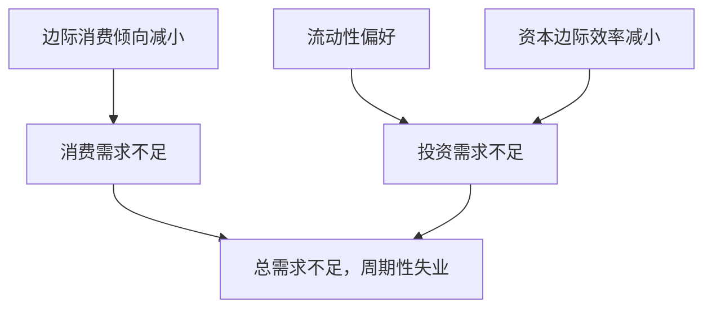

宏观经济学的四大目标：充分就业，经济增长，物价稳定，国际收支平衡。

## 01 宏观经济学导论

> [!summary] 小结
> 
> - 宏观经济学以整个国民经济为考察对象，研究经济中各有关总量（国内生产总值、总需求、总供给、就业总量及价格水平等等）的决定及其变动。
> - 宏观经济学研究内容包括：长期经济增长、经济周期与波动、失业、通货膨胀、国际收支平衡、政府宏观经济政策等重大问题。
> - 宏观经济学研究经济总体及行为，微观经济学研究经济个体及行为，在研究对象、研究方法、研究内容等方面存在着重大差异。但是，宏观分析是建立在微观分析的基础上。
> - 宏观经济学重要的研究方法：总量分析法、流量和存量分析法、事前变量和事后变量分析法。
> - 整体经济的循环流动可以通过循环流动图来表示，具体分为两部门、三部门和四部门经济的循环流动。注入和漏出是两个重要的概念。

宏观与微观：

- **宏观经济学**：研究的问题是一个国家整体经济的运作情况以及政府如何运用经济政策来影响国家整体经济运作。
- **微观经济学**：以单个企业或家庭的行为作为研究对象，研究它们的供求行为与价格变动之间的关系。

|      | 宏观经济学     | 微观经济学     |
| ---- | --------- | --------- |
| 理论依据 | 凯恩斯主义经济学  | 新古典经济学    |
| 基本假设 | 需求不足、存在失业 | 资源稀缺、充分就业 |
| 分析方法 | 总量分析      | 个量分析      |
| 分析对象 | 国民经济总体    | 家庭、企业、市场  |
| 研究中心 | 国民收入      | 市场价格      |
| 主要目标 | 社会福利最大    | 个体利益最大    |

流量与存量：

- **流量**：一定时期内测算的量。
- **存量**：某个时间点测算的量。

整体经济分类：

- 2 部门：居民，企业。
- 3 部门：居民，企业，政府。
- 4 部门：居民，企业，政府，国外。

注入与漏出：

- **注入**：居民户以外的支出来源，包括政府开支、投资、出口。
- **漏出**：居民户没有用于消费的家庭收入，包括政府税收、储蓄、进口。

## 02 宏观经济的基本指标及其衡量

> [!summary] 小结
> 
> - SNA 与 MPS 是对总产出核算的两种指标体系。SNA 衡量更全面、更科学，被广泛采用。
> - 国内生产总值(GDP) 是指在一定时期内（通常为 1 年）在一国领土范围内所生产的最终产品和劳务的市场价值之和。GDP 分为名义 GDP 和实际 GDP。
> - GDP 核算可用三种方法：支出法、收入法、增加价值法。理论上，三种方法核算出的 GDP 是相等的。
> - 国民收入账户体系中还包括了与 GDP 相联系的其他指标：NDP，GNP，NNP，PI，DPI。这些指标之间通过一定方法相互转换。
> - GDP 在衡量经济福利、人们生活方面存在着缺陷，可以通过一定方法进行校正。
> - 在国民经济核算中，由于是事后变量的核算，不管两部门、三部门还是四部门，`I = S` 是恒等关系。

### GDP

**国内生产总值**(**GDP**)：经济社会（*一国或一地区*）在一定时期内运用生产要素所生产的全部 *最终产品*（物品和劳务）的 *市场价值*。

理解 GDP：

- GDP *只计入最终产品*（而不计入中间产品）。
- GDP 是生产出（*而不是所售卖掉*）的最终产品价值。
- GDP *是流量*（而不是存量）。
- GDP 是一个 *地域概念*，而国民生产总值（GNP）是一个国民概念。
- GDP 考虑 *市场价值*，家务劳动、自给自足生产等非市场活动不计入 GDP。

`GNP + 外国人在本国的产出 = GDP + 本国人在外国的产出`

理解 *最终产品*：一定时期内生产、同期内不再加工、不重复出售 / 转卖或进一步加工、可供最终消费和使用的产品。

- 固定资产：作投资用的产品，看似中间产品，但由于不再加工和出售，故属于最终产品。
- 库存增加：企业年终库存货物，可以看作是企业自己最终卖给自己的最终产品。
- 煤等特殊资源：有时视作最终产品（家用），有时视作中间产品（工厂）。

GDP 折算指数：`名义 GDP / 实际 GDP`。

GDP 的缺陷：

- 很多经济活动无法计入 GDP：一些没有经过市场交换程序的经济活动，如家务劳动，地下经济，DIY 活动等，不在 GDP 统计范围内。
- GDP 反映福利水平变动存在较大局限性：闲暇，外部性，收入分配。

### GDP 核算方法

原则：`总产出 = 总收入 = 总支出`。

#### 支出法

通过核算整个社会在一定时期内购买最终产品的支出总和来求得。

GDP 以支出法的核算结果为准。

`GDP = 消费支出 + 投资 + 政府购买 + 净出口`

理解支出法：

- 消费支出不包括 *住宅*，它属于投资。
- 政府购买不包括转移支付、公债利息等。
- 净出口可能为负值。

#### 收入法

`GDP = 工资 + 利息 + 利润 + 租金 + 间接税和企业转移支付 + 折旧 + 统计误差`

### 其他宏观经济指标

- 国内生产净值(NDP)：`NDP = GDP - 资本折旧`，反映一定时期生产活动的最终净成果。
- 国民收入(NI)：`NI = NDP - 间接税 - 企业转移支付 + 政府补贴`，一国生产要素在一定时期内提供生产性服务所得报酬（即工资、利息、租金和利润）的总和。
- 个人收入(PI)：`PI = NI - 公司所得税 - 社会保险(税费) - 公司未分配利润 + 政府给个人的转移支付(和支付利息等)`，个人从各种途径所获得的收入的总和。
- 个人可支配收入(DPI)：`DPI = PI - 个人所得税`。

> [!question] 计算 GDP 及相关指标
> 
> 某年某国的最终消费为 8000 亿元，国内私人投资 5000 亿元（其中 500 亿元为弥补当年消耗的固定资产），政府税收为 3000 亿元（其中间接税为 2000 亿元，其他为个人所得税），政府支出为 3000 亿元（其中政府购买为 2500 亿元、政府转移支付为 500 亿元），出口为 2000 亿元，进口为 1500 亿元。
> 
> 请计算 GDP、NDP、NI、PI、DPI。

> [!done] 解答
> 
> `GDP = 8000 + 5000 + 2500 + 2000 - 1500 = 16000`
> 
> `NDP = 16000 - 500 = 15500`
> 
> `NI = 15500 - 2000 = 13500`
> 
> `PI = 13500 + 500 = 14000`
> 
> `DPI = 14000 - (3000 - 2000) = 13000`

### 国民收入基本公式：储蓄 - 投资恒等式

### 总产出核算的校正

名义 GDP 与实际 GDP：

- **名义 GDP** / 货币 GDP：用生产产品和劳务的当年价格计算的全部最终产品的市场价值。
- **实际 GDP**：用从前某一年作为不变的价格作为基期价格计算出来的全部最终产品的市场价值。

**GDP 平减指数**：某年的实际 GDP $\div$ 该年的名义 GDP。

## 03 国民收入的决定：收入-支出模型

> [!summary] 小结
> 
> - 均衡产出是社会总需求与总供给相等的产出水平。
> - 均衡产出 = match 经济构成
> 	- 两部门经济 => `y = c + i`
> 	- 三部门经济 => `y = c + i + g`
> 	- 四部门经济 => `y = c + i + g + x - m`
> - 消费是总需求最重要的组成部分。凯恩斯认为：随着收入的增加，消费也增加，但是消费增加总是不及收入增加得多。即，存在边际消费倾向递减。
> - {xx} 乘数指 {xx} 增加引起收入增 / 减的倍数，有投资乘数、消费乘数、政府购买乘数、转移支付乘数、平衡预算乘数、进口乘数、出口乘数。

### 均衡产出

**均衡产出**：与总需求相等的产出。

### 凯恩斯的消费理论

#### 凯恩斯定律

- **需求决定供给**：不论需求量多少，经济体总能以不变的价格提供该量。
- **价格不变**：
    - 总需求的变动引起产量和收入的变动，而不会引起价格的变动。
    - 需求变动时，企业首先考虑调整产量，而不是变动价格。

#### 消费

简单线性消费函数：`c = a + by`

- `a`：自发性消费，最基本的生存消费支出，不随收入变化而变动。
- `b`：收入中用于消费的比例，又称边际消费倾向，`0 < b < 1`。

**消费倾向**：消费与收入的比率。

- **平均消费倾向**(**APC**)：指家庭或个人将多大比例的收入用于消费，剩下的就是储蓄，可以 `> 1`（表示收入极低，必须借钱消费）。
- **边际消费倾向**(**MPC**)：每增减 1 元国民收入所引起的消费变化，是消费曲线上任一点切线的斜率，`0 < MPC < 1`。
	- 例如：收入由￥100 增加到￥120，消费由￥80 增加到￥94，`MPC = (94 - 80) / (120 - 100) = 0.7`。
- *APC* 和 *MPC* 都随着收入增加而递减，因此总有 `MPC < APC`（`边际 < 平均`）。

#### 储蓄

储蓄为 `收入 - 消费`，在简单线性消费函数下即 `y - c`。

- 由于储蓄与消费的互补关系，**平均储蓄倾向**(**APS**) 和 **边际储蓄倾向**(**MPS**) 分别与 *APC* 和 *MPC* 互补。
- *APS* 和 *MPS* 都随着收入增加而递增，因此总有 `MPC > APC`（`边际 > 平均`）。

#### 社会消费函数

社会消费函数并非是居民消费函数的简单加总，因为存在：

- 收入分配
- 税收政策 
- 公司未分配利润

### 两部门国民收入的决定

假设自发计划投资 `i` 固定，由 `i = s`，`y = c + i`，`c = a + by` 解得：**均衡国民收入** `y = (a + i) / (1 - b)`。

### 乘数论

**乘数**：某变量 `x` 变化 `dx` 引起另外一个变量 `y` 变化 `dy`，则称 `x` 对 `y` 的乘数为 `dy / dx`。

> [!question] 消费函数相关计算
> 
> 假设消费函数 `c = 100 + 0.8 y`，投资 `i = 50`。
> 
> 1. 求均衡收入、消费和储蓄。
> 2. 如果当时实际产出（即收入）为 800，试求企业非意愿存货积累为多少？
> 3. 若投资增到 100，试求增加的收入。
> 4. 若消费函数为 `c = 100 + 0.9y`，投资 `i` 仍为 50，收入和储蓄各为多少？投资增到 `100` 时，收入增加多少？
> 5. 消费函数变动后，乘数有何变化？

> [!done] 解答
> 
> 1. 均衡收入 `y = (100 + 50) / (1 - 0.8) = 750`，`c = 100 + 0.8 * 750 = 700`，`s = y - c = 750 - 700 = 50`
> 2. 企业非意愿存货积累 = `产出 - 需求 = 800 - 750 = 50`
> 3. 新的均衡收入 `y1 = (100 + 100) / (1 - 0.8) = 1000`，比原先增加 `y1 - y = 250`
> 4. 新的均衡收入 `y2 = (100 + 50) / (1 - 0.9) = 1500`，新的储蓄 `s2 = y2 - c2 = 1500 - 1450 = 50`；投资增加到 `100` 时的均衡收入 `y3 = (100 + 100) / (1 - 0.9) = 2000`，比 `y2` 增加 `500`
> 5. 乘数从 `1 / (1 - 0.8) = 5` 变为 `1 / (1 - 0.9) = 10`

### 三部门收入决定及其乘数

`y = (a + i + g + btr - bT) / (1 - b)`

- `tr`：转移支付
- `T`：定量税

| 乘数     | 公式                                  |
| ------ | ----------------------------------- |
| 投资     | $k_i = {\Large \frac{1}{1 - b}}$    |
| 政府购买   | $k_g = {\Large \frac{1}{1 - b}}$    |
| 政府转移支付 | $k_{tr} = {\Large \frac{b}{1 - b}}$ |
| 税收     | $k_T = {\Large \frac{-b}{1 - b}}$   |
| 政府平衡预算 | $k_b = 1$                           |

> [!question] 三部门收入计算
> 
> 假设消费函数 `c = 100 + 0.8y`，投资 `i = 50`，政府购买支出 `g = 200`，政府转移支付 `tr = 62.5`，直接税 `T = 250`。
> 
> 1. 求均衡收入。
> 2. 求投资乘数、政府支出乘数、税收乘数、转移支付乘数、平衡预算乘数。
> 3. 假定达到充分就业所需要的国民收入为 1200，试问：若分别以——增加政府购买 / 减少税收 / 以同一数额增加政府购买和税收（平衡预算）——实现这个充分就业的国民收入，各需要多少数额？

> [!done] 解答
> 
> 1. 均衡收入 `y = (100 + 50 + 200 + 0.8 * 62.5 - 0.8 * 250)`
>  `/ (1 - 0.8) = 1000`
> 2. 分别为 `5` / `5` / `-4` / `4` / `1`（参见上方公式）
> 3. 要 `y1 = 1200`，即 `dy = y1 - y = 200`，
> 	- 增加政府购买：`dg = dy / kg = 200 / 5 = 40`
> 	- 减少税收：`dT = dy / kT = 200 / (-4) = -50`
> 	- 以同一数额增加政府购买和税收：两者乘数之和 `k = dg + dT`
> 	`= 5 - 4 = 1`，则 `d = dy / k = 200 / 1 = 200`

## 04 国民收入的决定：IS-LM 模型

### 投资的决定

投资：建设新企业、购买设备、厂房等各种生产要素的支出以及存货的增加。

简单地理解，投资就是资本的形成。

决定投资的经济因素：

- 反向变动：利率
- 同向变动：折旧，预期收益，预期通货膨胀率

### IS-LM 曲线

通过利率把货币经济和实物经济联系了起来，认为货币不是中性的，货币市场和产品市场是有联系的，相互作用的。

货币政策使 LM 曲线移动，财政政策使 IS 曲线移动。

- 投资对利率变动敏感 => IS 曲线较平坦
- 货币需求对利率变动敏感 => LM 曲线较平坦

**流动性偏好陷阱**：当利率极低的时候，人们认为利率不太可能再下降，会无限持有货币。

## 06 失业、通货膨胀与经济周期

> [!summary] 小结
> 
> - 失业可分为摩擦性失业、结构性失业和周期性失业，自然失业率是经济在稳定状态下的失业率，也是经济在正常时期的失业率，它取决于离职率和就职率。失业的影响既有经济方面的，也有社会方面的，奥肯定律从经济方面说明了失业与实际GDP 的关系。
> - 通货膨胀可以从不同角度进行分析，既可以按照价格上升的速度进行分类，也可按照对价格影响的差别进行分类，还可按照人们的预期程度进行分类。通货膨胀现象既可以从货币角度解释，又可以从总供给或总需求角度解释，还可以从经济结构角度来解释。通货膨胀的经济效应包括再分配效应和产出效应。
> - 菲利普斯曲线最初反映的是失业率与工资上涨率之间的关系，现代的菲利普斯曲线主要反映失业率与通货膨胀率之间的关系。根据菲利普斯曲线控制总需求的决策者面临通货膨胀与失业之间的短期替换关系。

### 失业概述

**失业**：在一定年龄范围内 *愿意工作* 但 *没有工作* 且 *正在寻找工作* 的人。

失业的分类：

- **周期性失业**：需求不足的失业、*非自愿失业*，由于总需求不足而引起的短期失业。
- 源于劳动市场供求双方的失业
	- **摩擦性失业**：生产过程中难以避免的由于转业等原因而造成的短期、局部性、过渡性失业，*通常源于劳动力供给方*。
	- **结构性失业**：劳动力的供给和需求不匹配所造成的失业，*通常源于劳动力需求方*。

失业率：`失业人数 / 劳动力人数`。

**充分就业**：消灭了周期性失业，不存在 *非自愿失业*（而非不存在失业）。

*充分就业* 是宏观经济学的首要目标。

**自然失业**：由于某些难以避免的原因引起的失业。

**自然失业率**：实现充分就业时的失业率。

### 失业的经济学解释

**古典失业**：由于工资刚性所引起的失业，也称工资性失业，凯恩斯称为自愿失业。

凯恩斯对失业的解释：

### 失业的影响

- 社会影响：失业威胁着作为社会单位和经济单位的家庭的稳定，影响情感。
- 经济影响：失业的经济影响可以用机会成本来解释，经济中本可由失业工人 生产的产品和劳务就损失了。

**奥肯定律**：失业率每高于自然失业率 $1$ 个百分点，实际 GDP 将低于潜在 GDP $2$ 个百分点，反之亦然。

### 通货膨胀概述

**通货**：现金（纸币和铸币），即流通于社会上的货币。

**通货膨胀**：信用货币制度下，流通中的货币数量超过经济实际需要，而引起的货币贬值，和物价水平 *全面而持续的上涨*。

**通货膨胀率**：从一个时期到另一个时期价格水平变动的百分比，`(now - pre) / pre`，又等于 `货币增长率 - 产出增长率 + 流通速度变化率`。

### 通货膨胀的经济效应

#### 再分配效应

**货币收入**：一个人所获得的货币数量。

**实际收入**：消费者用他的货币收入能买到的物品和劳务的数量。

通货膨胀时价格上升，导致实际收入下降。

`实际利率 = 名义利率 - 通货膨胀率`

#### 产出效应

- 需求拉动的通货膨胀：产出增加，收入增加。
- 成本推动的通货膨胀：收入或产量减小，引致失业
- 超级通货膨胀：产出减少，经济趋于崩溃。

#### 通货膨胀的有利论与有害论

- 有利论：温和通胀，利于经济发展，不可缺少。
- 有害论：通货膨胀政策是饮鸩止渴。

#### 治理通货膨胀的对策

- 需求方面
    - 货币政策：减少货币供应量。
    - 财政政策：增加税收。
- 供给方面
    - 收入政策：工资物价管理政策。
    - 收入指数化政策：工资、利息、各种证券收益以及其它收入一律同物价变动联系而作出调整。
    - 人力政策：改善劳工市场。
    - 对外经济政策：阻止国外通货膨胀的输入。

### 失业与通胀的关系

#### 菲利普斯曲线方程

`通货膨胀率 = -k (失业率 - 自然失业率)`

含义：失业与通货膨胀存在着此消彼长的替代关系（通货膨胀率的增加可以换取一定的失业率的减少，反之亦然）。
