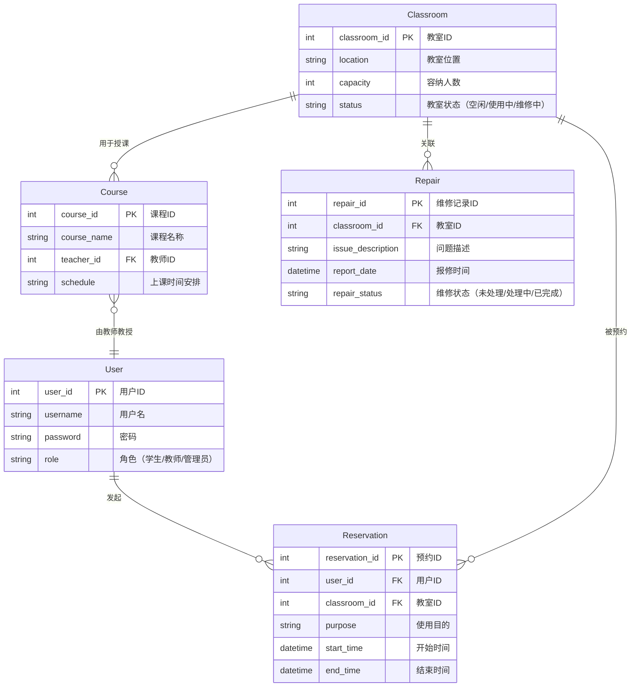

### 01 项目介绍

#### 背景

教育资源的合理配置与高效利用是高校管理工作的核心任务之一，直接影响教学质量和师生满意度。随着现代高校规模的不断扩大和教学需求的日益多样化，传统的教室管理方式逐渐难以满足需求。  
- **传统管理方式的局限性**：传统人工教室管理依赖于手工登记、电话沟通等方式，导致在处理教室冲突、资源调度和临时需求时效率低下，且容易出现错误。尤其是在课表调整、临时会议安排以及教室设备故障报修时，问题尤为突出。  
- **信息化管理的需求**：现代化管理需要实现教室资源的动态分配、实时监控和数据统计分析，以适应教学计划的灵活性和个性化需求。本项目的设计目标是解决高校教室资源管理中的痛点，为管理人员和使用者提供便捷、高效的解决方案。  
- **社会背景**：当前，高校数字化和信息化建设逐渐成为趋势，智能化管理系统的开发和部署已成为高校提升管理水平和教学质量的重要方向。本项目的开发正是顺应这一趋势，旨在为高校教室管理提供更先进的技术支持。

#### 需求来源

本项目的需求来源于对高校不同用户群体的深入调研，覆盖了教室使用的主要参与者和管理者：  
- **高校师生**：学生希望能够快速查询教室的空闲情况，随时预约自习室或课外活动场地；教师则需要便捷的工具来安排课程或组织学术活动。两者都希望系统能够提供简单易用的操作界面。  
- **教学楼管理人员**：负责教室日常维护和资源分配的人员希望有一个统一的平台，能够实时了解教室的使用状态，快速处理冲突情况，并记录教室设备报修和维护的历史记录。  
- **后勤与保卫处**：后勤人员希望通过系统简化教室设施损坏的报修流程，提高维修效率；保卫处人员则期望系统能够与安全监控设备对接，及时响应教室突发事件，如非法侵入或紧急求助。

通过问卷调查、访谈和现场观察，团队充分挖掘了这些用户的实际需求，并明确了系统需解决的核心问题，确保设计目标具有针对性和可行性。

#### 国内外技术现状

针对教室资源管理，国内外在技术开发和系统应用方面存在一些显著的差异：  
- **国内现状**：  
  国内一些高校已经开发了专用的教室管理系统，但这些系统往往功能较为单一，仅能满足教室预约或简单的课表管理。大多数系统缺乏灵活性，难以应对复杂的跨部门需求。此外，这些系统通常是孤立运行，缺少与教务系统、后勤管理系统等平台的联动功能，导致资源利用率较低。  
- **国外现状**：  
  国外一些知名高校采用了功能更全面的资源管理软件，例如 Roomzilla 和 EMS，这些系统集成了预约管理、资源监控、数据分析等功能。然而，这些软件通常设计复杂，操作门槛较高，且成本昂贵，限制了它们在普通高校的普及性。此外，国外系统在本地化适配方面存在一定问题，难以满足国内高校的具体需求。  

基于对国内外现状的分析，本项目将吸收国内外先进经验，设计一套兼具易用性和灵活性的教室管理系统：  
- **功能方面**：在满足基本需求（如教室预约和状态查询）的同时，扩展数据分析、设备管理和应急处理功能。  
- **集成方面**：实现与教务系统、后勤系统和安全监控系统的无缝对接，提升资源整合效率。  
- **成本控制**：采用开源技术和模块化设计，降低开发和部署成本，使系统适用于更多高校。  

通过结合国内外技术优势，本项目力求在功能性、易用性和成本效益之间找到最佳平衡点，为高校教室管理提供切实可行的解决方案。

### 02 需求分析过程

#### 软件系统环境图

> [!tip] 绘图思路（ChatGPT）
> 
> - 描述：绘制系统的外部交互环境，展示与教务系统、安全监控系统、后勤系统的接口关系，以及各用户端的操作入口（微信小程序、Web 管理端）。
> - 内容：
> 	- 左侧：教务系统、安全监控系统等外部接口。
> 	- 中间：教室管理系统主模块。
> 	- 右侧：用户端（学生、教师、管理人员）。
> 	- 使用箭头标明数据流和功能交互。

#### 功能性需求

> [!done] 从「需求说明书」获取

#### 非功能性需求

> [!done] 从「需求说明书」获取

#### 数据需求

#### 主要功能界面展示

> [!tip] 绘图思路
> 
> 可简单修改实训 web 项目

### 03 需求分析过程体会

#### 需求获取过程

需求获取是需求分析过程的第一步，也是至关重要的一环。本项目通过多种方式全面了解用户的真实需求，包括问卷调查、访谈和实地观察等。  

- **问卷调查**：向高校的学生、教师和教室管理人员发放问卷，收集他们在日常使用教室资源时遇到的主要问题和改进建议。问卷设计中既包含封闭式问题（如评分或选择），也包含开放式问题，以确保能够收集到详尽的意见。  
- **访谈**：邀请不同角色的用户（如教学管理员和保卫处人员）进行深入访谈，了解他们在工作流程中遇到的痛点。例如，教学管理员提到课表调整复杂且容易出错，而保卫处人员则希望更高效地监控教室内安全状况。  
- **实地观察**：在教学楼内实地调研，观察管理人员处理教室资源冲突的过程，同时体验学生寻找可用教室的现状。这种方法有助于发现用户可能未意识到的隐性需求。  

整个过程中，团队始终以用户为中心，坚持多轮反馈机制，确保需求覆盖的广度和深度，同时针对不同用户群体的特殊需求，制定差异化的解决方案。

#### 需求管理工具应用

为了高效管理复杂的需求信息，本项目采用了需求管理工具 **Jira**。Jira 的使用贯穿于需求的收集、整理、跟踪和变更管理全过程。  

- **需求分类与分级**：将收集到的需求按照功能性需求和非功能性需求进行分类，并根据优先级分级，如必须实现的核心需求与可选的次要需求。  
- **需求跟踪**：通过 Jira 的版本控制功能，记录每条需求的变更历史。无论是因用户反馈调整需求，还是因技术约束而修改需求，都能轻松追踪。  
- **协作与沟通**：使用 Jira 的任务分配功能，将需求分析任务分配到小组成员，并实时更新进度。这种透明化的流程大大提升了团队内部的协作效率。  
- **统计与报告**：利用 Jira 自动生成需求状态报告，定期向指导老师和相关人员汇报需求分析进展，确保项目开发的每个阶段都在掌控之中。

通过系统化的需求管理工具应用，团队有效减少了因需求变更导致的冲突和遗漏，为后续的设计和开发工作奠定了坚实基础。

#### 需求建模工具应用

在需求分析阶段，为了更清晰地定义和展示系统功能，团队使用了建模工具 **StarUML**，以标准化的方式创建多种模型，便于所有团队成员达成一致。

- **用例图**：绘制了系统与外部用户和系统交互的用例图，明确了每种用户（如学生、教师、管理人员）在系统中的角色和可用功能。用例图还帮助团队识别出潜在的系统边界问题。  
- **活动图**：对主要业务流程（如教室预约、教室状态更新等）进行了活动图建模，展示用户和系统之间的交互过程以及各操作的先后顺序。  
- **时序图**：针对复杂的场景（如课程安排和冲突处理），绘制了时序图，描述不同对象之间的消息传递顺序和时序关系。这不仅帮助团队理清了逻辑，也为后续的编码提供了重要参考。  
- **ER 图**：虽然主要用于数据需求分析，但它同样是建模工具的一部分。通过 ER 图，团队直观地定义了系统的核心数据实体及其相互关系。

在使用建模工具的过程中，团队感受到直观图形化表达的优势，不仅降低了误解的可能性，还为各个模块的开发提供了清晰的蓝图。同时，模型的复用性也为后续的系统维护和扩展提供了便利。

### 04 总结

#### 需求分析的重要性

需求分析作为软件开发生命周期的起点，是决定项目成败的关键环节。它不仅帮助开发团队明确系统的开发目标，还能有效降低开发过程中的不确定性。  
- **明确开发目标**：通过系统的需求分析，团队能够清晰了解用户的核心需求和期望功能，避免因目标模糊导致的资源浪费和返工。需求分析提供了一个明确的方向，指导后续的设计与开发活动。  
- **减少后期变更成本**：需求变更是软件开发中最常见的问题之一，但明确和准确的需求分析能够将变更发生的频率降到最低。通过前期的细致分析，团队可以在开发前发现潜在问题，减少后期修改代码和重新测试的成本。  
- **提高用户满意度**：需求分析过程中，团队始终保持与用户的沟通与反馈，确保所开发的功能与用户需求高度契合。这种以用户为中心的开发方式最终能够显著提升用户的使用体验和满意度。

在本项目中，团队从需求获取到需求建模，完整经历了需求分析的各个环节，为后续的设计与开发工作奠定了坚实的基础。可以说，没有扎实的需求分析，就不可能有成功的项目交付。

#### 项目问题

尽管本次项目需求分析取得了许多成果，但在实际过程中仍暴露出一些问题，需要进一步优化和改进：  

1. **部分用户需求表达模糊**  
   在需求获取阶段，部分用户（尤其是非技术背景的用户）对自身需求的表述不够清晰，导致团队需要多次沟通和确认。例如，某些用户希望“预约功能更灵活”，但无法具体说明“灵活”在操作流程和系统实现上的具体含义。这种情况不仅增加了沟通成本，也延长了需求分析时间。未来可以通过提供更加具体的需求示例，或采用引导式问卷和访谈问题，帮助用户更准确地表达需求。

2. **各子系统接口定义较复杂**  
   教室管理系统需要与多个外部系统（如教务系统、安全监控系统）进行数据交互，而这些系统的接口规范和数据格式存在差异，给需求分析和后续开发带来了挑战。接口定义的复杂性增加了分析和实现的难度，可能在系统整合阶段造成延误。建议在下一步工作中加强与相关系统的协作，提前确定接口规范，并对接口测试进行全面规划。

#### 改进建议

为了更好地解决这些问题并确保项目目标的全面实现，团队提出以下改进建议： 

- **持续与用户沟通**：在开发过程中，不断与用户保持沟通，动态调整需求，确保开发工作与用户期望保持一致。同时引入原型设计，让用户能更直观地理解系统功能，减少需求表达中的模糊性。  
- **优化接口定义流程**：组织跨部门会议，集中讨论接口定义中的重点和难点，确保接口文档的规范性和清晰度。此外，可以考虑采用标准化的接口技术（如 RESTful API）以简化实现难度。  
- **提升团队需求分析能力**：通过培训和经验总结，进一步提升团队成员的需求分析技能，尤其是需求获取和文档化的能力，避免因沟通不畅或记录不完善导致的问题。

需求分析过程中的问题虽有挑战，但也为团队提供了宝贵的改进机会。通过总结经验教训，不断优化流程，本项目的后续开发必将更加高效，最终实现系统的预期目标并超越用户的期望。